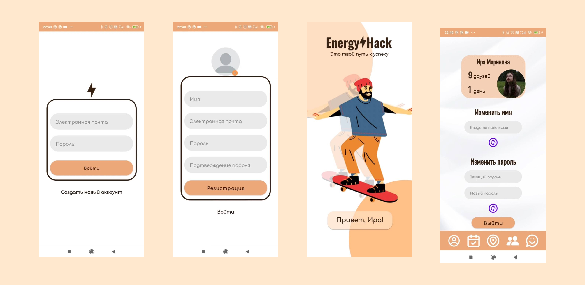
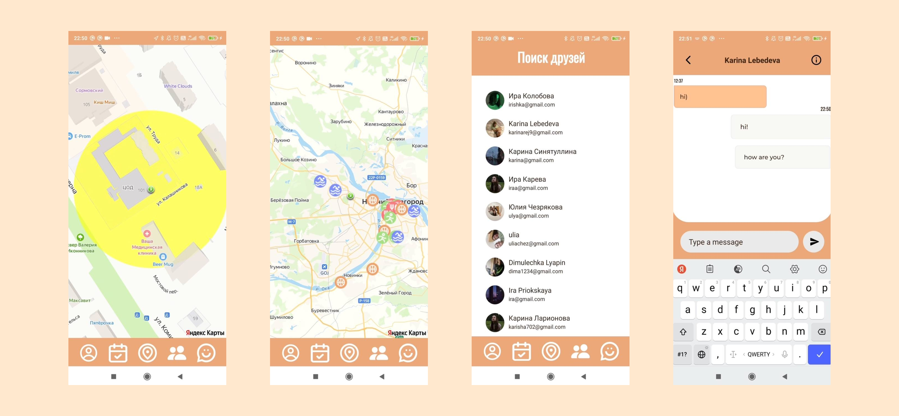

# EnergyHack

_Read this in other language: [English](README.md), [Русский](README.ru.md)_

## Achievements

🥇 This project was created to participate in the competition "В вышку за проектом" and took 1st place

The project was also presented:
- 🏅 3rd place - 54-th city conference Scientific Society of students "Эврика"
- 🏅 3rd place - Competition of scientific research works of schoolchildren Applied Informatics - 2023 from the National Research Nizhny Novgorod State University named after N.I. Lobachevsky

## Project Description

The EnergyHack application is implemented to bring together people seeking to form healthy habits and lead an active lifestyle.

Here the user can find like-minded people in the chat, places for walking / training on the map (currently only in the Nizhny Novgorod region), mark their successes in the calendar and get motivating advice.

❗❗❗The project is under development

## Feature List

- Creation/Change account.
- Yandex MapKit map with placemarks for walking, sports and healthy eating.
- Automatic detection of the user's current location.
- A list of all users of the application.
- Create a chat with any of the users.

## Plans for improvement

- Make the calendar page complete: add a calendar, tips, tasks of the day, motivational quotes, the ability to mark the progress of the task of the day
- Ability to add friends: add a friends section for each user and the ability to send/receive/reject friend requests
- Ability to search for users: add a search bar by name. Also add filtering to be able to find people by interests
- Change of personal data: add the ability to change personal data: username, password, photo
- Adding descriptions for labels: Add a detailed description for all labels to attract users and give them a good idea of the specified location
- Adding labels not only for the Nizhny Novgorod region: expanding the area of labels
- Chat improvement: adjust the design and functionality

## Current status of the project

## Authors

### **🍓Team SOT🍓**

Team members:
* Arina Zimina - developer, teamleader
* Karina Siniatullina - developer
* Julia Chezryakova - editor
* Irina Kolobova - designer

## Frameworks and technologies used

* Description: Java is a strongly typed general-purpose object-oriented programming language developed by Sun Microsystems (later acquired by Oracle). Development is conducted by a community organized through the Java Community Process; the language and the main technologies implementing it are distributed under the GPL license.
* Resources:
  * Official Website: [Official Website](https://www.java.com/ru/)
  * Documentation: [Documentation](https://docs.oracle.com/en/java/)

* Description: Android Studio is the official integrated development environment (IDE) for Google's Android operating system, built on JetBrains' IntelliJ IDEA software and designed specifically for Android development.
* Resources:
  * Official Website: [Official Website](https://developer.android.com/studio?hl=ru)
  * Documentation: [Documentation](https://developer.android.com/develop?skip_cache=true%22%22)

* Description: Firebase is a set of tools and services for the development of mobile and web applications from Google. With it, you can quickly deploy a backend with your own server logic, connect databases and configure user authorization. The platform is often used to create MVP and develop with limited resources.

* Resources:
  * Official Website: [Official Website](https://firebase.google.com/)
  * Documentation: [Documentation](https://firebase.google.com/docs?hl=ru)
